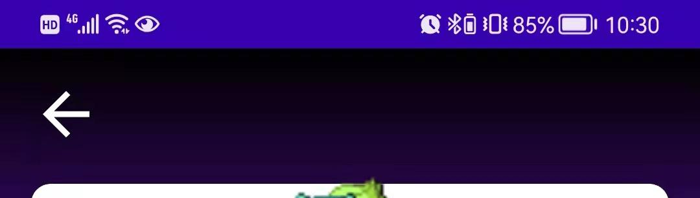

# Table of content
- [Table of content](#table-of-content)
- [reimplement PokemonGo project with detail explanation](#reimplement-pokemongo-project-with-detail-explanation)
    - [Mian page](#mian-page)
      - [MainActivity-](#mainactivity-)
      - [header](#header)
      - [Error goes wrong](#error-goes-wrong)
    - [Detail page](#detail-page)
      - [Top section](#top-section)
      - [avctar](#avctar)
      - [weight and height](#weight-and-height)
      - [type](#type)
      - [base stats](#base-stats)
  - [conclusion:](#conclusion)


# reimplement PokemonGo project with detail explanation

### Mian page

#### MainActivity- 

```koltin
setContent {
            JetpackComposePokedexTheme {
                val navController = rememberNavController()
                NavHost(navController = navController,startDestination = "pokemon_list_screen"){
                    composable("pokemon_list_screen"){
                        PokemonListScreen(navController = navController)
                    }
                    composable("pokemon_detail_screen/{pokemonName}",
                    arguments = listOf(
                        navArgument("pokemonName"){
                            type = NavType.StringType
                        }
                    ))
                    {
                        val random = Random()
                        val dominantColor = Color(random.nextInt(256),
                            random.nextInt(256),
                            random.nextInt(256))

                        val pokemonName = it.arguments?.getString("pokemonName")

                        if (dominantColor != null) {
                            PokemonDetailScreen(
                                dominantColor = dominantColor,
                                pokemonName = pokemonName?.toLowerCase(Locale.ROOT) ?: "",
                                navController = navController
                            )
                        }
                    }
                }
            }
        }
```

simiplify

```kotlin
setContent {
            JetpackComposePokedexTheme {
                val navController = rememberNavController()
                NavHost(navController = navController,startDestination = "pokemon_list_screen"){
                    // route 
                    composable("pokemon_list_screen"){
                        // return activity
                        PokemonListScreen(navController = navController)
                    }
                }
            }
}

```

#### header


First, display logo image.

```kotlin
Spacer(modifier = Modifier.height(20.dp))
Image(
      painter = painterResource(id = R.drawable.ic_international_pok_mon_logo),
      contentDescription = "Pokemon",
      modifier = Modifier
                    .fillMaxWidth()
                    .align(CenterHorizontally)
)
```

Second, write a search bar 

```kotlin
@Composable
fun SearchBar(
    modifier: Modifier = Modifier,
    hint: String = "",
    onSearch: (String) -> Unit = {}
) {

    var text by remember {
        mutableStateOf("")
    }
    var isHintDisplayed by remember {
        mutableStateOf(hint != "")
    }
    //search bar box
    Box(modifier = modifier) {
        BasicTextField(
            value = text,
            onValueChange = {
                text = it
                onSearch(it)
            },
            maxLines = 1,
            singleLine = true,
            textStyle = TextStyle(color = Color.Black),
            modifier = Modifier
                .fillMaxWidth()
                .shadow(5.dp, CircleShape)
                .background(Color.White, CircleShape)
                .padding(horizontal = 20.dp, vertical = 12.dp)
                .onFocusChanged {
                    isHintDisplayed = it.isFocused && text.isEmpty()
                }
        )
        if(isHintDisplayed) {
            Text(
                text = hint,
                color = Color.LightGray,
                modifier = Modifier
                    .padding(horizontal = 20.dp, vertical = 12.dp)
            )
        }
    }
}
```


```kotlin
@Composable
fun PokemonList(
    navController: NavController,
    viewModel: PokemonListViewModel = hiltNavGraphViewModel()
) {
    val pokemonList by remember { viewModel.pokemonList }
    val endReached by remember { viewModel.endReached }
    val loadError by remember { viewModel.loadError }
    val isLoading by remember { viewModel.isLoading }
    val isSearching by remember { viewModel.isSearching }
// 
    LazyColumn(contentPadding = PaddingValues(16.dp)) {
        val itemCount = if(pokemonList.size % 2 == 0) {
            pokemonList.size / 2
        } else {
            pokemonList.size / 2 + 1
        }
        items(itemCount) {
            if(it >= itemCount - 1 && !endReached && !isLoading && !isSearching) {
                LaunchedEffect(key1 = true) {
                    viewModel.loadPokemonPaginated()
                }
            }
            PokedexRow(rowIndex = it, entries = pokemonList, navController = navController)
        }
    }
//  when network goes wrong
    Box(
        contentAlignment = Center,
        modifier = Modifier.fillMaxSize()
    ) {
        if(isLoading) {
            CircularProgressIndicator(color = MaterialTheme.colors.primary)
        }
        if(loadError.isNotEmpty()) {
            RetrySection(error = loadError) {
                viewModel.loadPokemonPaginated()
            }
        }
    }

}
```


```
@Composable
fun PokedexEntry(
    entry: PokedexListEntry,
    navController: NavController,
    modifier: Modifier = Modifier,
    viewModel: PokemonListViewModel = hiltNavGraphViewModel()
) {
    val defaultDominantColor = MaterialTheme.colors.surface
    val random = Random()
    val dominantColor = Color(random.nextInt(256),
        random.nextInt(256),
        random.nextInt(256))

    val painter = rememberImagePainter(
        data = entry.imageUrl,
        builder = {
            transformations(CircleCropTransformation())
            error(android.R.drawable.ic_dialog_alert)
        }
    )

    Box(
        contentAlignment = Center,
        modifier = modifier
            .shadow(5.dp, RoundedCornerShape(10.dp))
            .clip(RoundedCornerShape(10.dp))
            .aspectRatio(1f)
            .background(
                Brush.verticalGradient(
                    listOf(
                        dominantColor,
                        defaultDominantColor
                    )
                )
            )
            .clickable {
                navController.navigate(
                    "pokemon_detail_screen/${entry.pokemonName}"
                )
            }
    ) {
        Column {
            Box(
                modifier = Modifier.size(120.dp)
                    .align(CenterHorizontally)
            ){
                Image(
                    painter = painter,
                    contentDescription = null,
                    modifier = Modifier.size(120.dp)
                )
                val painterState = painter.state
                if(painterState is ImagePainter.State.Loading)
                {
                    CircularProgressIndicator(
                        color = MaterialTheme.colors.primary,
                        modifier = Modifier.scale(0.5f)
                    )

                }
            }
            Text(
                text = entry.pokemonName,
                fontFamily = RobotoCondensed,
                fontSize = 20.sp,
                textAlign = TextAlign.Center,
                modifier = Modifier.fillMaxWidth()
            )
        }
    }
}
```


```kotlin
@Composable
fun PokedexRow(
    rowIndex: Int,
    entries: List<PokedexListEntry>,
    navController: NavController
) {
    Column {
        Row {
            PokedexEntry(
                entry = entries[rowIndex * 2],
                navController = navController,
                modifier = Modifier.weight(1f)
            )
            //中间的间隔
            Spacer(modifier = Modifier.width(16.dp))
            if(entries.size >= rowIndex * 2 + 2) {
                PokedexEntry(
                    entry = entries[rowIndex * 2 + 1],
                    navController = navController,
                    modifier = Modifier.weight(1f)
                )
            } else {
              //填充空白
                Spacer(modifier = Modifier.weight(1f))
            }
        }
        //底下的间隔
        Spacer(modifier = Modifier.height(16.dp))
        
    }
}

```


Conclusion： add image from load storage
```
Image(
      painter = painterResource(id = R.drawable.ic_international_pok_mon_logo),
      contentDescription = "Pokemon",
      modifier = Modifier
                    .fillMaxWidth()
                    .align(CenterHorizontally)
)
```
add image from Internet
```
val painter = rememberImagePainter(
        data = entry.imageUrl,
        builder = {
            transformations(CircleCropTransformation())
            error(android.R.drawable.ic_dialog_alert)
        }
    )
Image(
      painter = painter,
      contentDescription = null,
      modifier = Modifier.size(120.dp)
    )

```


#### Error goes wrong


```kotlin
@Composable
fun RetrySection(
    error: String,
    onRetry: () -> Unit
) {
    Column {
        Text(error, color = Color.Red, fontSize = 18.sp)
        Spacer(modifier = Modifier.height(8.dp))
        Button(
            onClick = { onRetry() },
            modifier = Modifier.align(CenterHorizontally)
        ) {
            Text(text = "Retry")
        }
    }
}
```

example:

```kotlin
Box(
        contentAlignment = Center,
        modifier = Modifier.fillMaxSize()
    ) {
      // loading circlr imdicator
        if(isLoading) {
            CircularProgressIndicator(color = MaterialTheme.colors.primary)
        }
      // retry
        if(loadError.isNotEmpty()) {
            RetrySection(error = loadError) {
                viewModel.loadPokemonPaginated()
            }
        }
    }
```

### Detail page

#### Top section




```kotlin
@Composable
fun PokemonDetailTopSection(
    navController: NavController,
    modifier: Modifier = Modifier
) {
   // nav bar with vertical gradient background color 
    Box(
        contentAlignment = Alignment.TopStart,
        modifier = modifier
            .background(
                Brush.verticalGradient(
                    listOf(
                        Color.Black,
                        Color.Transparent
                    )
                )
            )
    ) {
      // 后退按钮
        Icon(
            imageVector = Icons.Default.ArrowBack,
            contentDescription = null,
            tint = Color.White,
            modifier = Modifier
                .size(36.dp)
                .offset(16.dp, 16.dp)
                .clickable {
                    navController.popBackStack()
                }
        )
    }
}
```

#### avctar


```kotlin

```

#### weight and height


```kotlin
@Composable
fun PokemonDetailDataItem(
    dataValue: Float,
    dataUnit: String,
    dataIcon: Painter,
    modifier: Modifier = Modifier
) {
    // vertical alignment
    Column(
        horizontalAlignment = Alignment.CenterHorizontally,
        verticalArrangement = Arrangement.Center,
        modifier = modifier
    ) {
      // 图标
        Icon(painter = dataIcon, contentDescription = null, tint = MaterialTheme.colors.onSurface)
        Spacer(modifier = Modifier.height(8.dp))
      // 数字
        Text(
            text = "$dataValue$dataUnit",
            color = MaterialTheme.colors.onSurface
        )
    }
}
@Composable
fun PokemonDetailDataSection(
    pokemonWeight: Int,
    pokemonHeight: Int,
    sectionHeight: Dp = 80.dp
) {
    val pokemonWeightInKg = remember {
        round(pokemonWeight * 100f) / 1000f
    }
    val pokemonHeightInMeters = remember {
        round(pokemonHeight * 100f) / 1000f
    }
    Row(
        modifier = Modifier
            .fillMaxWidth()
    ) {
      // 体重
        PokemonDetailDataItem(
            dataValue = pokemonWeightInKg,
            dataUnit = "kg",
            dataIcon = painterResource(id = R.drawable.ic_weight),
            modifier = Modifier.weight(1f)
        )
        Spacer(modifier = Modifier
            .size(1.dp, sectionHeight)
            .background(Color.LightGray))
      // 身高
        PokemonDetailDataItem(
            dataValue = pokemonHeightInMeters,
            dataUnit = "m",
            dataIcon = painterResource(id = R.drawable.ic_height),
            modifier = Modifier.weight(1f)
        )
    }
}

```


创建实例

```
PokemonDetailTopSection(
            navController = navController,
            modifier = Modifier
                .fillMaxWidth()
                .fillMaxHeight(0.3f)
                .align(Alignment.TopCenter)
        )
```

#### type


```kotlin
@Composable
fun PokemonTypeSection(types: List<Type>) {
    Row(
        verticalAlignment = Alignment.CenterVertically,
        modifier = Modifier
            .padding(16.dp)
    ) {
        for(type in types) {
            Box(
                contentAlignment = Alignment.Center,
                modifier = Modifier
                    .weight(1f)
                    .padding(horizontal = 8.dp)
                    .clip(CircleShape)
                    .background(parseTypeToColor(type))
                    .height(35.dp)
            ) {
                Text(
                    text = type.type.name.capitalize(Locale.ROOT),
                    color = Color.White,
                    fontSize = 18.sp
                )
            }
        }
    }
}
```

#### base stats


```kotlin
@Composable
fun PokemonBaseStats(
    pokemonInfo: Pokemon,
    animDelayPerItem: Int = 100
) {
    val maxBaseStat = remember {
        pokemonInfo.stats.maxOf { it.baseStat }
    }
    Column(
        modifier = Modifier.fillMaxWidth()
    ) {
        Text(
            text = "Base stats:",
            fontSize = 20.sp,
            color = MaterialTheme.colors.onSurface
        )
        Spacer(modifier = Modifier.height(4.dp))

        for(i in pokemonInfo.stats.indices) {
            val stat = pokemonInfo.stats[i]
            PokemonStat(
                statName = parseStatToAbbr(stat),
                statValue = stat.baseStat,
                statMaxValue = maxBaseStat,
                statColor = parseStatToColor(stat),
                animDelay = i * animDelayPerItem
            )
            Spacer(modifier = Modifier.height(8.dp))
        }
    }
}

@Composable
fun PokemonStat(
    statName: String,
    statValue: Int,
    statMaxValue: Int,
    statColor: Color,
    height: Dp = 28.dp,
    animDuration: Int = 1000,
    animDelay: Int = 0
) {
    var animationPlayed by remember {
        mutableStateOf(false)
    }
    val curPercent = animateFloatAsState(
        targetValue = if(animationPlayed) {
            statValue / statMaxValue.toFloat()
        } else 0f,
        animationSpec = tween(
            animDuration,
            animDelay
        )
    )
    // 动画
    LaunchedEffect(key1 = true) {
        animationPlayed = true
    }
    // 圆柱形背景
    Box(
        modifier = Modifier
            .fillMaxWidth()
            .height(height)
            .clip(CircleShape)
            .background(
                if (isSystemInDarkTheme()) {
                    Color(0xFF505050)
                } else {
                    Color.LightGray
                }
            )
    ) {
        Row(
            horizontalArrangement = Arrangement.SpaceBetween,
            verticalAlignment = Alignment.CenterVertically,
            modifier = Modifier
                .fillMaxHeight()
                .fillMaxWidth(curPercent.value) // 右边数字的位置
                .clip(CircleShape) 
                .background(statColor) // 属性值背景
                .padding(horizontal = 8.dp)
        ) {
          // 属性值
            Text(
                text = statName,
                fontWeight = FontWeight.Bold
            )
            Text(
                text = (curPercent.value * statMaxValue).toInt().toString(),
                fontWeight = FontWeight.Bold
            )
        }
    }
}

```

效果


## conclusion:

```kotlin

fun funname(
  paramaters name: paramaters type
){
  // 单一控件用
  Box(
    
  ){

  }
  // 竖排多控件用
  column{

  }
  // 横排多控件用
  row{
    
  }

// 添加控件属性

Box(
  horizontalArrangement = Arrangement.SpaceBetween, // 
  verticalAlignment = Alignment.CenterVertically, // 对齐位置
  modifier = Modifier
                .fillMaxHeight() // 
                .fillMaxWidth(curPercent.value) // 右边数字的位置
                .clip(CircleShape) // 圆形角
                .background(statColor) // 属性值背景
                .padding(horizontal = 8.dp) 
                .offset(y = 100.dp) // 上下移动距离
                .verticalScroll(scrollState) // enable scroller

){
  
}

}
```
